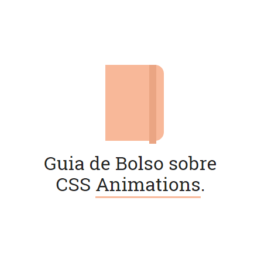

## CSS Animations Pocket Guide

Um guia de bolso para quem estuda ou trabalha com animações em CSS.

Leia o conteúdo do Guia [aqui](https://daliannyvieira.gitbooks.io/css-animations-pocket-guide/content/). An [English version](./translations/css-animations-pocket-guide.md) is coming.

## Contribuindo

Crie uma Issue com sugestões, ou confira as Issues já abertas e envie um Pull Request com novas seções ou atualização das existentes. Sua contribuição será muito bem vinda! :)

## Licença
[MIT License](https://github.com/daliannyvieira/css-animations-pocket-guide/blob/master/LICENSE) © [Dalianny Vieira](https://github.com/daliannyvieira)
