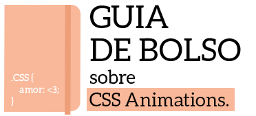

# Guia de Bolso sobre CSS Animations
Todos os [exemplos](http://codepen.io/collection/XmZvqo/) inclusos nesse guia estão disponíveis no codepen.
## Mapa

* [Introdução](#introdução)
	* [Recomendações](#recomendações)
* [Transitions](#transitions)
* [Transforms](#transforms)
* [Keyframes Animations](#keyframes-animations)
* [SVG Animations](#svg-animations)

## Introdução

###Recomendações

Para aproveitar melhor esse guia, é recomendado que se tenha um conhecimento prévio sobre HTML e CSS básico.

##Transitions

Transições podem ser usadas para adicionar uma transição de tempo em uma modificação por um determinado elemento. Adicionamos ao elemento a seguinte propriedade:

	.elemento {
		transition: <property> <duration>;
	}

